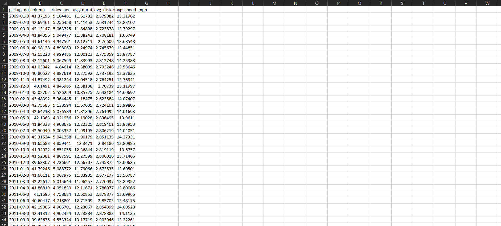
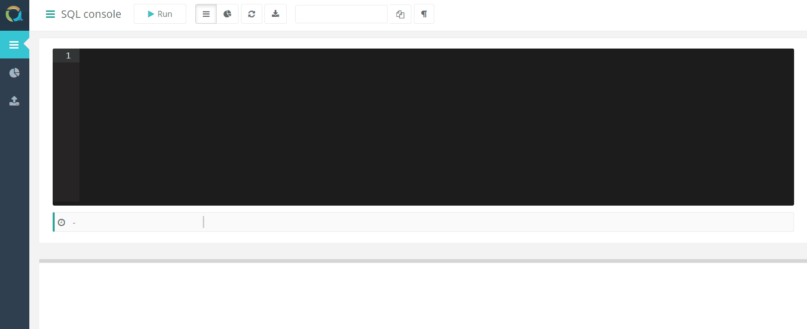
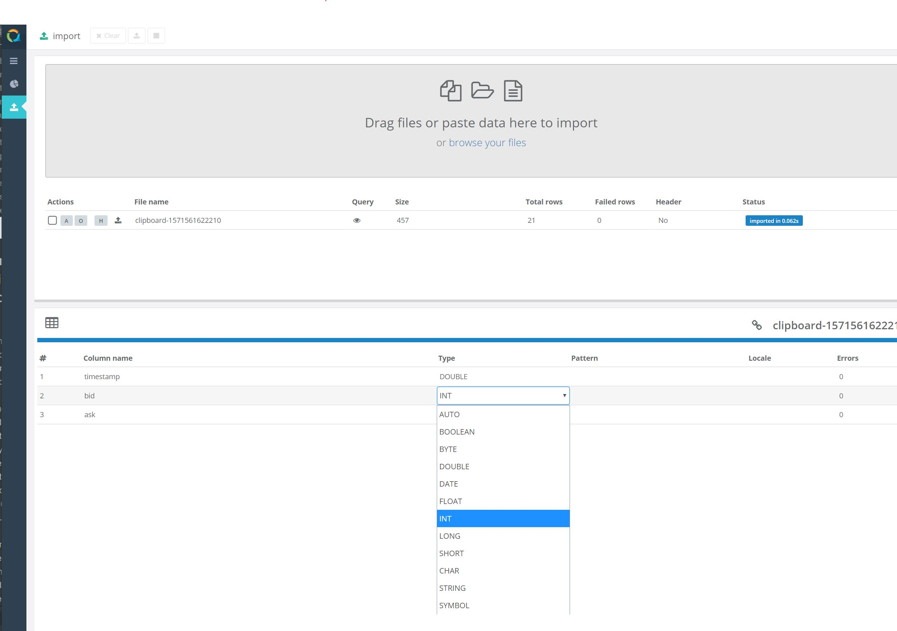

## Overview

QuestDB offers an intuitive web console to interact with your data without using the API.
It allows you to import data in to the database, run queries on the fly, and export data.
Each action will display a timer so you can get a sense of the performance.


> After starting QuestDB, you can access the console on [http://localhost:9000/index.html](http://localhost:9000/index.html)

If QuestDB is running on another machine of your network, the webconsole can be accessed on **http://IP_OF_THE_MACHINE:9000**

## Loading Data


The load screen can be accessed by clicking this icon on the left-side menu. 

>Load menu is accessed with this button on the left navigation bar  


### Drag and drop
Simply drag and drop the data file you wish to import in the drag & drop area:


### Import from clipboard

You can also `COPY & PASTE` from your clipboard into this area. Select the data you would like to import
(range from Excel, csv text etc) and it will import automatically upon pasting into this area.

You can copy data from clipboard from csv, excel and text files



### Browse files import
Click the [browse your files]() button, and select the file you wish to import.

<aside class="important">
<p>
When using this method rather than the API, the database will immediately ingest your file,
using automatic type recognition. If you would like to change parameters before ingesting, for example
for a large file, we recommend you use the API.
</p>
</aside>


### Copy command
You can use the `COPY` command directly in the web console to import from a file.

Syntax is `COPY tablename FROM file_path`

Example:
```sql
COPY prices FROM `c:\\user\desktop\prices.csv`;
```




### Customising the upload

After you have loaded data with one of the two methods listed above, you will see it in your console.
You can now change the import parameters and import again if you wish. The option buttons you are:

>


<table class="alt tall">
<thead>
<th>Option</th>
<th>Description</th>
</thead>
<tbody>
<tr>
<td class="param"><center>A</center></td>
<td>
If selected, data uploaded will be appended to the existing table.
</td>
</tr>

<tr>
<td class="param"><center>O</center></td>
<td>
If selected, data uploaded will override the existing data.
</td>
</tr>

<tr>
<td class="param"><center>H</center></td>
<td>
If selected, the first row of your import data will be recognised as  headers. 
If not, header names will be generated automatically (f1, f2, etc.)
</td>
</tr>

</tbody>
</table>

>This button will trigger the upload with the parameters selected.  

### Amending schema
When importing from file or copy/paste, QuestDB will automatically detect the type of data in each column.
If you click on the File name in the import window, it will open the schema of the file in question.
You can see which types have been used.

>You can amend Type for any column by selecting the type of your choice in the dropdown menu.
> You will then need to trigger the import again using the import button   


 


## Querying Data
>The web console allows you to run queries on your database directly from the browser. 
You can access it via this button situated on the left-side menu:  


### Running queries
Simply type your query in the editor. Then click 


The results will be displayed in the table below the SQL editor. 
You will also see metrics such as `execution time` and `number of records`. 

Example:


### Exporting Query Results
Once you have received results form a query, you can download them in a `.csv` file through your browser 
by clicking the download button at the top of the console.