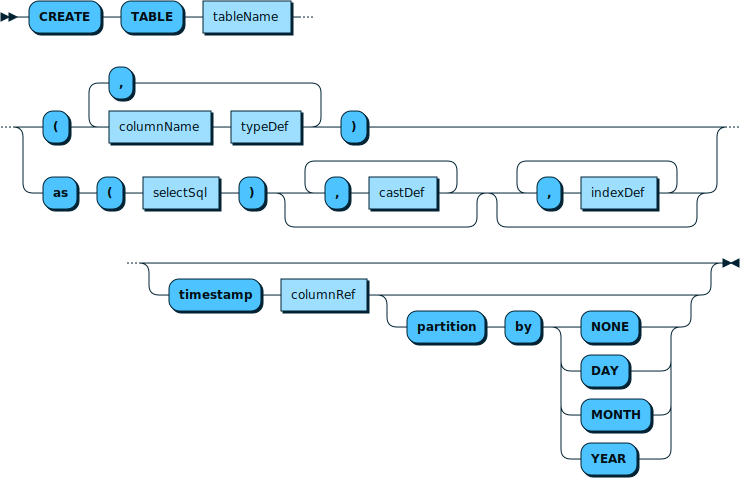
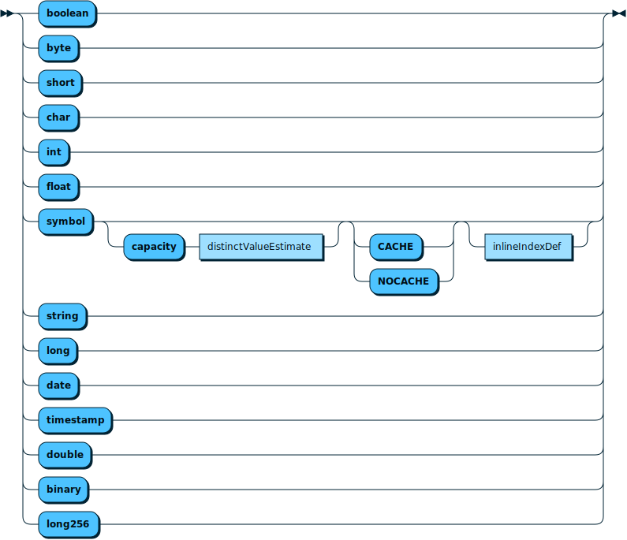

## Synopsis
 
Creates new table in the database.  

## Syntax



## Description

* `tableName` - a name used to reference table in SQL statements. Internally table name is used as directory name on the file system. It can contain both
ASCII and unicode characters. Table name containing spaces must be enclosed in _single_ quotes, for example:

    ```sql
    create table 'example out of space' (a int)
    ```
  > `tableName` must be unique and must not contain '.' character
      
* `columnName` - a name used to reference columns of table. Just like table name, column name is used as a part of file name internally, although it does support
both ASCII and unicode characters, file system special character restrictions still apply.

  Maximum number of columns in a table is 2,147,483,647
  
  > `columnName` must be unique in context of table and must not contain '.' character

* `typeDef` - column [type name](datatypes.md) with additional options. 

  

* `distinctValueEstimate` - optionally you can hint QuestDB how many distinct values this column is going to have. QuestDB will
use this value to size data structures used to support symbol. These data structures will resize themselves when necessary to allow
QuestDB to function correctly. Under-estimating symbol value count might result in drop of performance whereas over-estimating - in
higher disk space and memory consumption. When `distinctValueEstimate` is not specified, a configuration default is used (`cairo.default.symbol.capacity`). 


* `CACHE | NOCACHE` - a flag to tell QuestDB how to cache symbols. `CACHE` means that QuestDB will use Java Heap based Map to resolve symbol
values and keys. When column has large number of distinct symbol values (over 100,000) heap impact might be significant and depending on
heap size might cause OutOfMemory error. To avoid Java Heap impact, `NOCACHE` will leverage off-heap structure, which can deal with larger value
count but is slower. Default option is `CACHE`.

* `inlineIndexDef` - when present, QuestDB will create and maintain [index](indexes.md) for `symbol` column.

  

* `indexCapacityDef` - storage options for the index

  

* `valueBlockSize` - index storage parameter. This value is optional and will default to the value of configuration parameter `cairo.index.value.block.size`.
`valueBlockSize` tells QuestDB how many rowids to store in a single storage block on disk. Consider the following example.
Your table has 200 unique stock symbols and 1,000,000,000 stock quotes over time. Index will have to store 1,000,000,000/200 
row IDs for each symbol, e.g. 5,000,000 per symbol. When `valueBlockSize` is 1,048,576 QuestDB will use 5 blocks to store the row IDs, but when `valueBlockSize` is 1,024,
block count will be 4,883. To attain better performance the fewer blocks are used to store row IDs the better.

  At the same time over-sizing `valueBlockSize` will result in higher than necessary disk space usage. 

* `castDef` - casts type of cherry-picked column. `columnRef` must reference existing column in the `selectSql`

  
  
* `indexDef` - instructs QuestDB to create an index for one of table's columns. This clause references column name to be indexed.
  The referenced column muse be of type `SYMBOL`

  
  
* `timestamp` - references a column in new table, which will be the nominated timestamp. Such column must be of type `timestamp`

  > Nominated timestamp cannot be changed after table is created (not yet implemented)

* `partition by` - the [partitioning strategy](partitions.md) for the table.

  > Partitioning strategy cannot be changed after table is created. A new table will have to be created.

  
## Usage

There are three main use cases of `create table`: 
* create a new table
* clone existing SQL structure
* create and populate table from results of a SQL select statement

### Create new table example

Create vanilla table without nominated timestamp and not partitioned. Such table can accept data in any order.

```sql
CREATE TABLE my_table(symb SYMBOL, price DOUBLE, ts TIMESTAMP, s STRING)
```

Create the same table but with nominated timestamp to have QuestDB enforce chronological order of `ts` values.

```sql
CREATE TABLE my_table(symb SYMBOL, price DOUBLE, ts TIMESTAMP, s STRING) timestamp(ts)
```

Create table and partition by `DAY`

```sql
CREATE TABLE my_table(symb SYMBOL, price DOUBLE, ts TIMESTAMP, s STRING) timestamp(ts)
  partition by DAY
```

Create table with `SYMBOL` column having all options

```sql
CREATE TABLE my_table(
    symb SYMBOL capacity 256 nocache index capacity 1048576, 
    price DOUBLE, 
    ts TIMESTAMP, s STRING
) timestamp(ts)  partition by DAY
``` 

### Clone existing SQL structure

Cloning existing SQL structure can clone a table, when SQL is `select * from tab`  or any arbitrary SQL result:

```sql
create table x as (
    select 
        rnd_int() a,
        rnd_double() b,
        rnd_symbol('ABB', 'CDD') c
    from
        long_sequence(100)
    where false
)
```

> Note `where false` condition.

Clone existing _wide_ table and change type of cherry-picked columns:

```sql
create table x as (select * from y where false)
    , cast(price as long)
    , cast(sym as symbol index)
```

here we changed type of `price` (assuming it was `INT`) to `LONG` and changed type of `sym` to `SYMBOL` and created index.

### Create new table using SQL structure and data

Lets assume we imported a text file into table `taxi_trips_unordered` and now we want to turn this data into time series thru
ordering trips by `pickup_time`, assign dedicated timestamp and partition by month:

```sql
create table taxi_trips as (
  select * from taxi_trips_unordered order by pickup_time
) timestamp(pickup_time) partition by MONTH
```
