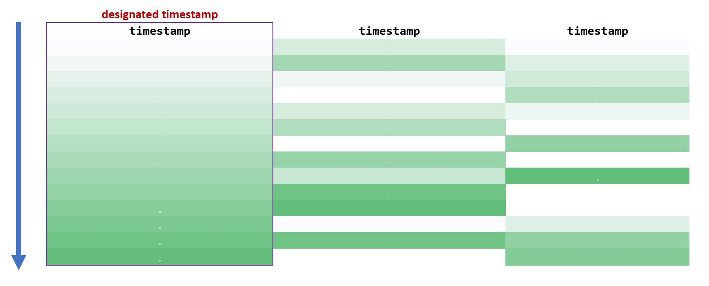

 
QuestDB offers the option to elect a column as `designated timestamp`. This allows to leverage specific
high-performance time-series functions of QuestDB, but introduces a constraint on the column in question that
will reject out of order inserts.

#### Properties
- Only a `timestamp` column can be `designated timestamp`
- Only `one` column can be elected for a given table.
- `designated timestamp` can be elected either 
    - with table creation
    - on the fly on sub-tables created within a query

#### Advantages
Electing a `designated timestamp` allows to:
- leverage timestamp partitions. For more information, please refer to the **[partitions section](partitions.md)**.
- use time-series joins such as `ASOF JOIN`. For more information please refer to the  **[joins section](joins.md)**.

#### Constraints
Once a column is elected `designated timestamp`, it will enforce an order policy on this column. This means that
out of order inserts will be rejected. This does not affect the behaviour of other columns

#### Examples

Representation of `designated timestamp` as a special column alongside other existing timestamp columns. 
Note that
 - the `designated timestamp` column only allows ordered timestamps 
 - any other `timestamp` column tolerates out of order timestamps 
 

Attempts to insert `out of order` timestamps will be rejected:

