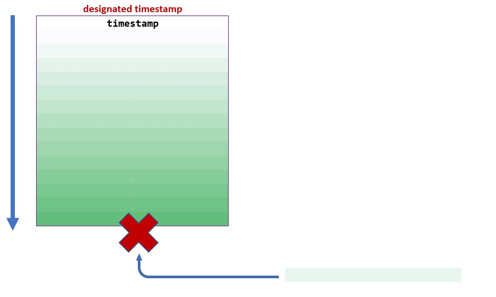

 
QuestDB offers the option to elect a column as `designated timestamp`. This allows to leverage specific
high-performance time-series functions of QuestDB, but introduces a constraint on the column in question that
will reject out of order inserts.

#### Properties
- Only a `timestamp` column can be `designated timestamp`
- Only `one` column can be elected for a given table.
- `designated timestamp` can be elected either 
    - with table creation
    - on the fly on sub-tables created within a query

>Once a column is elected `designated timestamp`, it will enforce an order policy on this column. 
- Inserts in `designated timestamp` need to be incrementing
- Out of order timestamps inserts will be rejected
- This does not affect the behaviour of other columns.

However it is worth noting that:
- Timestamps need not be unique. Duplicate timestamps are accepted.
- New timestamps need only be `superior or equal` to the latest timestamp in the column.


#### Advantages
Electing a `designated timestamp` allows to:
- leverage timestamp partitions. For more information, please refer to the **[partitions section](partitions.md)**.
- use time-series joins such as `ASOF JOIN`. For more information please refer to the  **[joins section](joins.md)**.

#### Examples

Representation of `designated timestamp` as a special column alongside other existing timestamp columns. 
Note that
 - the `designated timestamp` column only allows ordered timestamps 
 - any other `timestamp` column tolerates out of order timestamps 
 


Attempts to insert `out of order` timestamps will be rejected:




#### Working with timestamp order constraint
The constraint provides many benefits for both insert and query speed. However, it may be impractical in certain cases,
for example when inserting values from multiple devices with slightly different clocks or network conditions.
Luckily, there are ways to circumvent this with little overhead:

- Use the `database host clock` as `designated timestamp`, for example by using `systimestamp()`:

```sql
CREATE TABLE readings(
db_ts timestamp, 
device_ts timestamp, 
device_name symbol, 
reading int) 
timestamp(db_ts);
```

```sql
INSERT INTO readings VALUES(
systimestamp(),
to_timestamp('2020-03-01:15:43:21', 'yyyy-MM-dd:HH:mm:ss'),
'ig-1579JS09H',
133
);
```

For more information about `systimestamp()` and related functions, please check the 
**[date & time functions section](functionsDateAndTime.md)**.

- Use a temporary table for the latest partition and order data to insert into the main table when changing partition.

```sql
CREATE TABLE readings(
db_ts timestamp, 
device_ts timestamp, 
device_name symbol, 
reading int)
timestamp(db_ts)
PARTITION BY DAY;
```

```sql
CREATE TABLE readings_temp(
db_ts timestamp, 
device_ts timestamp, 
device_name symbol, 
reading int);
```

When switching over to a new day, insert the last day of data in an ordered fashion:
```sql
INSERT INTO readings 
    SELECT * FROM (readings_temp ORDER BY db_ts) timestamp(db_ts);
```
